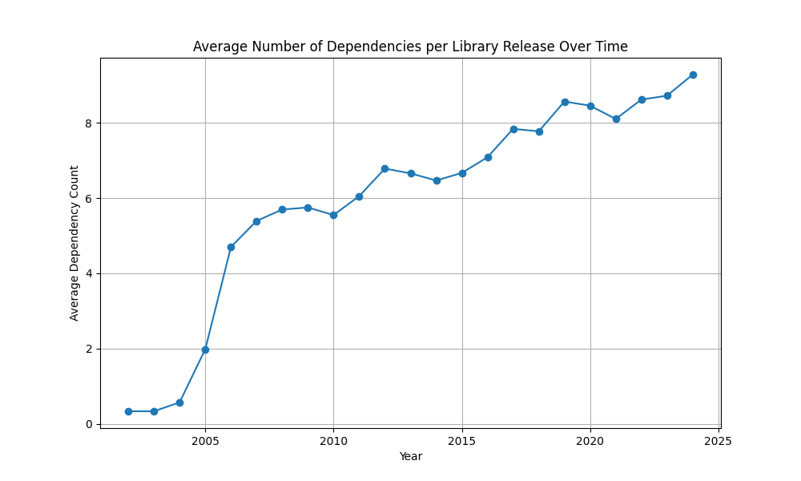
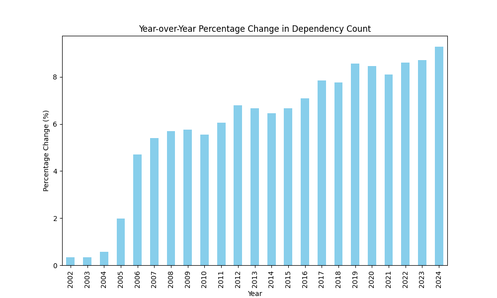
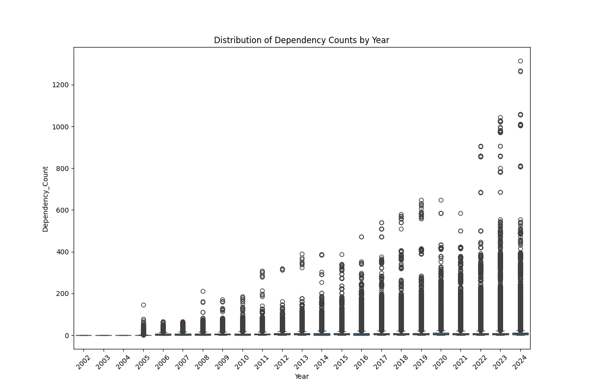
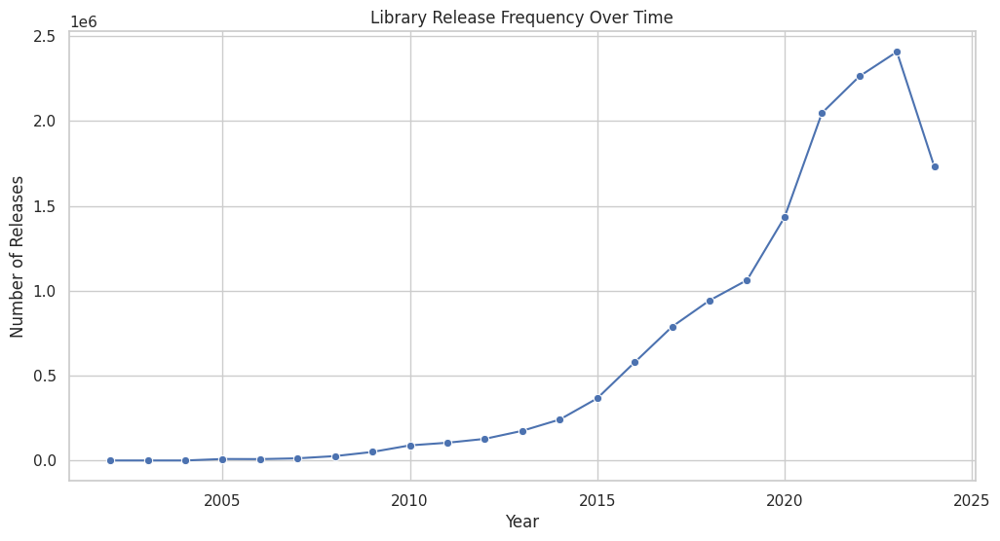
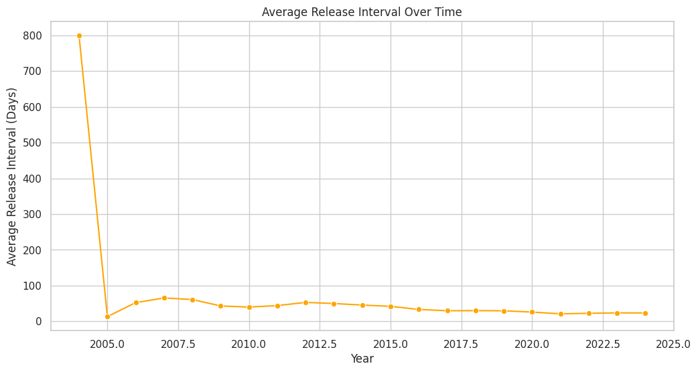

# Maven Central Ecosystem Evolution Analysis (MSR 2025)

This repository is part of the final project for the course **LOG6307E - Release Engineering and Mining Software Repositories** at **Polytechnique Montréal**. It is based on the [MSR 2025 Mining Challenge](https://2025.msrconf.org/track/msr-2025-mining-challenge) and focuses on analyzing the evolution of libraries in the Maven Central ecosystem.

The team aims to answer two key research questions:
1. **Do libraries tend to use more dependencies than in the past?**  
2. **Is the rhythm of library releases higher than in the past, and how has this rhythm evolved over time?**

This repository is based on a fork of [Neo4jWeaverDocker](https://github.com/Goblin-Ecosystem/Neo4jWeaverDocker). The section **# Setup Goblin Dataset and Weaver Docker** is directly adapted from the original repository to simplify the setup of the Maven Central database and Weaver API using Docker.

Additionally, the repository contains Jupyter notebooks in the `notebooks` folder to facilitate data exploration, visualization, and reproducibility of the analysis.

---

# Setup Goblin dataset and weaver docker

This directory allows you to set up the [Maven Central Neo4j database](https://zenodo.org/records/11104819) and the [Weaver API](https://github.com/Goblin-Ecosystem/goblinWeaver) easily using Docker.

## Fisrt launch
To run it for the first time, use the command:
```
docker-compose up --build
```

On first launch, Docker will download the database dump, which may take some time.

## Second launch
To run it after the first time, use the command:
```
docker-compose up
```

The data is thus persistent.

## Accessibility

**Neo4j user**: neo4j

**Neo4j password**: Password1

- **Neo4j** will be accessible via http://localhost:7474 (web interface).
- **Weaver REST API** will be accessible via http://localhost:8080.
- **Weaver documentation** will be accessible via http://localhost:8080/swagger-ui/index.html


# Data for RQ1: Do libraries tend to use more dependencies than in the past?

For RQ1, the approach is to fetch all libraries, then for each library, retrieve its releases and count the number of dependencies for each release. Finally, we use the dependency counts for each library release to compare averages across different timeframes and observe changes in dependency usage over time.


## Collect dependencies data

### Setup virtual environment (Optional)

```bash
python -m venv .venv
source .venv/bin/activate
```


### Install Required Dependencies

```bash
pip install -r requirements.txt 
```

### Run Data Collection Script

```bash
python rq1_fetch_deps.py
```

Given the large database, the script may take several hours to complete. Once finished, it will generate a `dependency_data.csv` file in the `data` folder. Alternatively, you can download the pre-mined data [here](https://mega.nz/file/dIJADCzT#VOdYTl3_RDrQ9XgW-u4A8RAaPUsd6yCbx9uJKbi7idU).


## Analyze and Plot Dependency Trends

After collecting the data, use the following command to analyze and visualize dependency trends over time:

```bash
python rq1_dependency_trends.py 
```


### Plot average dependency count over time



### Plot year-over-year percentage change in dependency count



### Box plot of dependency counts by year



# Data for RQ2: Is the rhythm of library releases higher than in the past?

For RQ2, the approach is to analyze the release patterns of libraries over time. The goal is to identify trends in the frequency of library releases and the interval between consecutive releases.

## Collect Release Data

The data for this analysis is part of the `dependency_data.csv` file generated during RQ1 data collection. This file contains the release dates for each library version, which will be used to calculate release intervals and frequencies.

## Analyze and Plot Release Rhythm Trends

Run the following script to analyze and visualize library release rhythms:

```bash
python rq2_release_requency.py
```

### Plot Release Frequency Over Time

This plot shows the total number of library releases per year, highlighting trends in release activity over time.



### Plot Average Release Interval Over Time
This plot shows the average interval (in days) between consecutive releases for libraries, providing insights into how the rhythm of releases has evolved.


